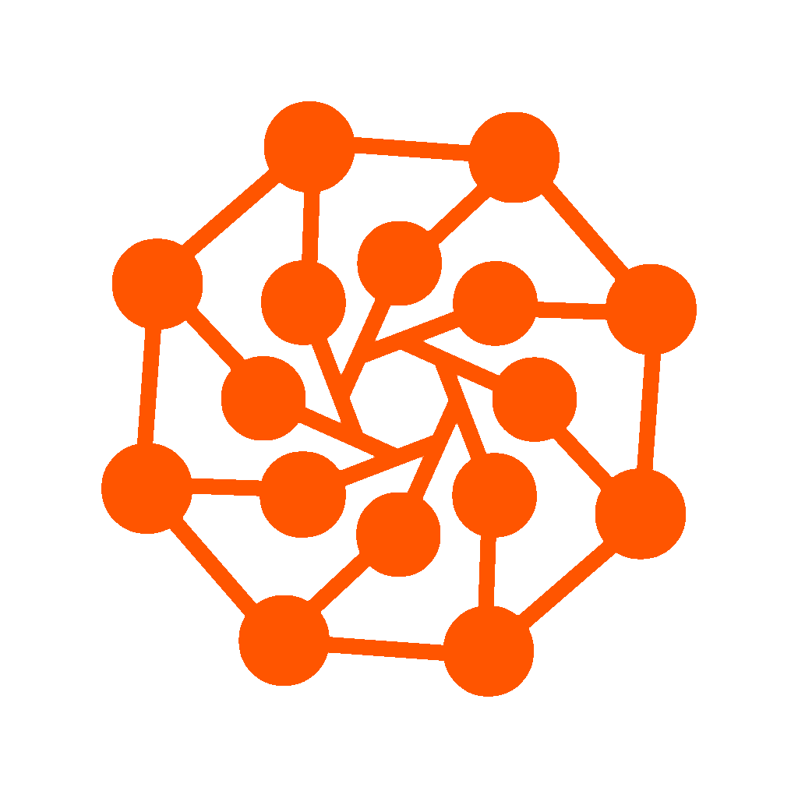

# DeepLearningSheet

ディープラーニングのモデルの中身理解のためのコード集

- 【注意】このページを利用して、または関して生じた事に関しては、**私は一切責任を負いません。** すべて **自己責任** でお願い致します。
- あくまで個人の趣味で作成しているものです　**PRは受け付けてますが、実装の依頼などは一切受け付けていませんので、そこをご理解頂けた方のみご利用下さい**

- ***Study-AI株式会社様 http://kentei.ai/ のAI実装検定のシラバスに使用していただくことになりました。　Study-AI株式会社様ではAIスキルを学ぶためのコンテンツを作成されているので、興味ある方はぜひ***

## Codes

### Model

| Method | Code | |
|:---:|:---:|:---:|
| VGG 16, 19| [pytorch](notes_pytorch/ImgRec/VGG_cifar10_pytorch.ipynb)  | 2014
| GoogLeNet-v1 | [pytorch](pytorch/googletnetv1_pytorch.ipynb) 
| ResNet | [pytorch](notes_pytorch/ImgRec/ResNet_cifar10_pytorch.ipynb) | 2015
| ResNeXt | [pytorch](notes_pytorch/ImgRec/ResNeXt_cifar10_pytorch.ipynb) | 2016
| Xception| [pytorch](notes_pytorch/ImgRec/Xception_cifar10_pytorch.ipynb)  | 2016
| DenseNet121, 169, 201, 264| [pytorch](notes_pytorch/ImgRec/DenseNet_cifar10_pytorch.ipynb) | 2016
| MobileNet-v1 | [pytorch](notes_pytorch/ImgRec/MobileNet_v1_cifar10_pytorch.ipynb) | 2017
| SEResNeXt | [pytorch](notes_pytorch/ImgRec/SEResNeXt_cifar10_pytorch.ipynb) | 2017 
| MobileNet-v2 | [pytorch](notes_pytorch/ImgRec/MobileNet_v2_cifar10_pytorch.ipynb) | 2018
| EfficientNet | [pytorch](notes_pytorch/ImgRec/EfficientNet_cifar10_pytorch.ipynb) | 2019

###  Interpretation

| Method |  Code |
|:---:|:---:|
| Grad-CAM | [pytorch](notes_pytorch/Interpretation/GradCAM_STL10_pytorch.ipynb)

### Segmentation

| Method | Code | |
|:---:|:---:|:---:|
| U-Net|  [pytorch](notes_pytorch/ImgSeg/UNet_VOC2012_pytorch.ipynb) | 2015

### Object Detection

| Method | Code |
|:---:|:---:|
| MaskRCNN (torchvision)| [pytorch](pytorch/MaskRCNN_torchvision_sample.ipynb) 

### AE
| Method | Code |
|:---:|:---:|
| AE |  [pytorch](notes_pytorch/AE/AE_MNIST_pytorch.ipynb)
| AEによる異常検知 | [pytorch](notes_pytorch/AE/AE_AnormalyDetection_MNIST_pytorch.ipynb)
| VAE (+ clustering)|  [pytorch](notes_pytorch/AE/VAE_MNIST_pytorch.ipynb)

### GAN
| Method | Code | 
|:---:|:---:|
| GAN | [pytorch](notes_pytorch/GAN/GAN_Cifar10_pytorch.ipynb) 
| DCGAN | [pytorch](notes_pytorch/GAN/DCGAN_Cifar10_pytorch.ipynb) 
| CGAN | [pytorch](notes_pytorch/GAN/CGAN_pytorch.ipynb) 
| pix2pix Seg | [ pytorch](pytorch/Pix2pix_Seg_pytorch.ipynb) [ tf.keras](scripts_tf_keras/pix2pix_tf2.1_keras.py)
| WGAN | [pytorch](notes_pytorch/GAN/WGAN_Cifar10_pytorch.ipynb)
| WGAN-GP | [pytorch](notes_pytorch/GAN/WGANGP_Cifar10_pytorch.ipynb) 
| alphaGAN MNIST | [ pytorch](pytorch/alphaGAN_mnist_pytorch.py)
| alphaGAN cifar10 | [ pytorch](pytorch/alphaGAN_cifar10_pytorch.py)
| CycleGAN | [ pytorch](pytorch/CycleGAN_pytorch.ipynb) 

### Other
| Method | Code |
|:---:|:---:|
| Style Transfer|  [tf.keras](tf/StyleTransfer_tf2.1_keras.py) |

### NLP
| Method | Code | 
|:---:|:---:|
| seq2seq | [ pytorch](pytorch/Seq2seq_pytorch.ipynb)
| Transformer | [ pytorch](pytorch/Transformer_pytorch.ipynb)
| HRED | [ pytorch](pytorch/HRED_pytorch_sand.ipynb) 
| Word2Vec (Skip-gram)| [ pytorch](pytorch/Word2vec_pytorch.ipynb) |

## License

<<<<<<< HEAD
=======
&copy; tired imori All Rights Reserved.

>>>>>>> 4ba63dc85e49600599f3d04850489e96a8970e72
This is under MIT License.
