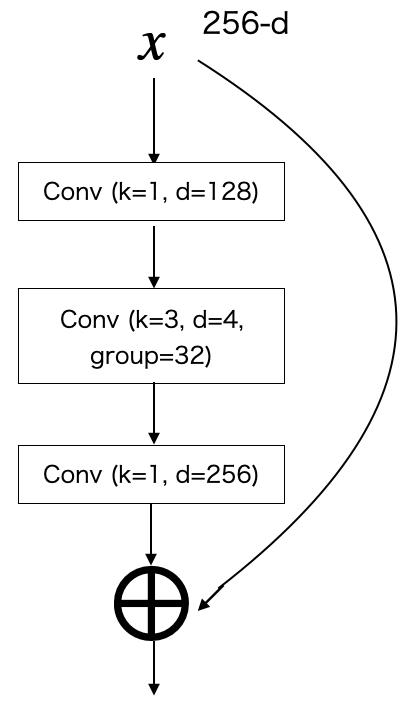
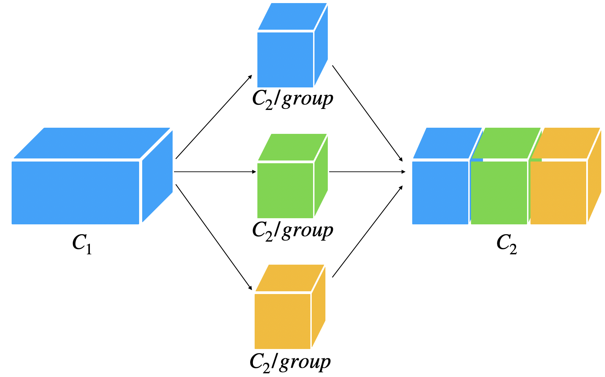

# ResNeXt

元論文 >> ResNeXt: Aggregated Residual Transformations for Deep Neural Networks https://arxiv.org/abs/1611.05431

ResNetのblockを改良したもの networkをチャンネルで細かく分けてそれぞれconvする構造

| ResNet block | ResNeXt block |
|:---:|:---:|
|  |   |

ResNeXtのblockを等価的に1 > 2 > 3と変換することができる

|ResNeXt block 1 | ResNeXt block 2 | ResNeXt block 3 |
|:---:|:---:|:---:|
|  |   |   |

Group convolutionの中身はこれ グループの数だけそれぞれconvをして、最後にチャンネル方向に連結する

 

## pytorch torchvision

```python
import torch
import torch.nn as nn
import torch.nn.functional as F
from torchvision import models

def get_model(out_dim, dropout=0.5):
    model = models.resnext101_32x8d(pretrained=True)
    del model.fc
    
    model.fc = nn.Sequential(
        nn.Linear(2048, 4096),
        nn.ReLU(),
        nn.Dropout(dropout),
        nn.Linear(4096, out_dim),
        nn.Sigmoid()
    )

    return model

```

## pytorch scratch

### ResNeXt50

```python
import torch
import torch.nn as nn
import torch.nn.functional as F


class ResNeXt50(torch.nn.Module):
    def __init__(self, out_dim):
        super(ResNeXt50, self).__init__()

        class ResNeXtBlock(torch.nn.Module):
            def __init__(self, in_f, f_1, out_f, stride=1, cardinality=32):
                super(ResNeXtBlock, self).__init__()

                self.stride = stride
                self.fit_dim = False
                
                self.block = torch.nn.Sequential(
                    torch.nn.Conv2d(in_f, f_1, kernel_size=1, padding=0, stride=stride),
                    torch.nn.BatchNorm2d(f_1),
                    torch.nn.ReLU(),
                    torch.nn.Conv2d(f_1, f_1, kernel_size=3, padding=1, stride=1, groups=cardinality),
                    torch.nn.BatchNorm2d(f_1),
                    torch.nn.ReLU(),
                    torch.nn.Conv2d(f_1, out_f, kernel_size=1, padding=0, stride=1),
                    torch.nn.BatchNorm2d(out_f),
                    torch.nn.ReLU(),
                )

                if in_f != out_f:
                    self.fit_conv = torch.nn.Conv2d(in_f, out_f, kernel_size=1, padding=0, stride=1)
                    self.fit_dim = True
            
            def forward(self, x):
                res_x = self.block(x)
                
                if self.fit_dim:
                    x = self.fit_conv(x)
                
                if self.stride == 2:
                    x = F.max_pool2d(x, 2, stride=2)
                    
                x = torch.add(res_x, x)
                x = F.relu(x)
                return x
        
        self.module = nn.Sequential(
            nn.Conv2d(3, 64, kernel_size=7, padding=3, stride=2),
            nn.BatchNorm2d(64),
            nn.ReLU(),
            nn.MaxPool2d([3, 3], padding=1, stride=2),
            ResNeXtBlock(64, 128, 256), # block2
            ResNeXtBlock(256, 128, 256),
            ResNeXtBlock(256, 128, 256),
            ResNeXtBlock(256, 256, 512, stride=2), # block3
            ResNeXtBlock(512, 256, 512),
            ResNeXtBlock(512, 256, 512),
            ResNeXtBlock(512, 256, 512),
            ResNeXtBlock(512, 512, 1024, stride=2), # block4
            ResNeXtBlock(1024, 512, 1024),
            ResNeXtBlock(1024, 512, 1024),
            ResNeXtBlock(1024, 512, 1024),
            ResNeXtBlock(1024, 512, 1024),
            ResNeXtBlock(1024, 512, 1024),
            ResNeXtBlock(1024, 1024, 2048, stride=2), # block5
            ResNeXtBlock(2048, 1024, 2048),
            ResNeXtBlock(2048, 1024, 2048),
        )

        self.avg_pool = torch.nn.AdaptiveAvgPool2d((1, 1))

        self.linear = torch.nn.Linear(2048, out_dim)
        
        
    def forward(self, x):
        x = self.module(x)
        x = self.avg_pool(x)
        x = x.view(x.size()[0], -1)
        x = self.linear(x)
        return x
```


### ResNeXt101

```python
import torch
import torch.nn as nn
import torch.nn.functional as F


class ResNeXt101(torch.nn.Module):
    def __init__(self, out_dim):
        super(ResNeXt101, self).__init__()

        class ResNeXtBlock(torch.nn.Module):
            def __init__(self, in_f, f_1, out_f, stride=1, cardinality=32):
                super(ResNeXtBlock, self).__init__()

                self.stride = stride
                self.fit_dim = False
                
                self.block = torch.nn.Sequential(
                    torch.nn.Conv2d(in_f, f_1, kernel_size=1, padding=0, stride=stride),
                    torch.nn.BatchNorm2d(f_1),
                    torch.nn.ReLU(),
                    torch.nn.Conv2d(f_1, f_1, kernel_size=3, padding=1, stride=1, groups=cardinality),
                    torch.nn.BatchNorm2d(f_1),
                    torch.nn.ReLU(),
                    torch.nn.Conv2d(f_1, out_f, kernel_size=1, padding=0, stride=1),
                    torch.nn.BatchNorm2d(out_f),
                    torch.nn.ReLU(),
                )

                if in_f != out_f:
                    self.fit_conv = torch.nn.Conv2d(in_f, out_f, kernel_size=1, padding=0, stride=1)
                    self.fit_dim = True
            
            def forward(self, x):
                res_x = self.block(x)
                
                if self.fit_dim:
                    x = self.fit_conv(x)
                
                if self.stride == 2:
                    x = F.max_pool2d(x, 2, stride=2)
                    
                x = torch.add(res_x, x)
                x = F.relu(x)
                return x

        block = []
        for _ in range(22):
            block.append(ResNeXtBlock(1024, 512, 1024))
        resblock4s = torch.nn.Sequential(*block)
        
        self.module = nn.Sequential(
            nn.Conv2d(3, 64, kernel_size=7, padding=3, stride=2),
            nn.BatchNorm2d(64),
            nn.ReLU(),
            nn.MaxPool2d([3, 3], padding=1, stride=2),
            ResNeXtBlock(64, 128, 256), # block2
            ResNeXtBlock(256, 128, 256),
            ResNeXtBlock(256, 128, 256),
            ResNeXtBlock(256, 256, 512, stride=2), # block3
            ResNeXtBlock(512, 256, 512),
            ResNeXtBlock(512, 256, 512),
            ResNeXtBlock(512, 256, 512),
            ResNeXtBlock(512, 512, 1024, stride=2), # block4
            resblock4s,
            ResNeXtBlock(1024, 1024, 2048, stride=2), # block5
            ResNeXtBlock(2048, 1024, 2048),
            ResNeXtBlock(2048, 1024, 2048),
        )

        self.avg_pool = torch.nn.AdaptiveAvgPool2d((1, 1))

        self.linear = torch.nn.Linear(2048, out_dim)
        
        
    def forward(self, x):
        x = self.module(x)
        x = self.avg_pool(x)
        x = x.view(x.size()[0], -1)
        x = self.linear(x)
        return x
```
