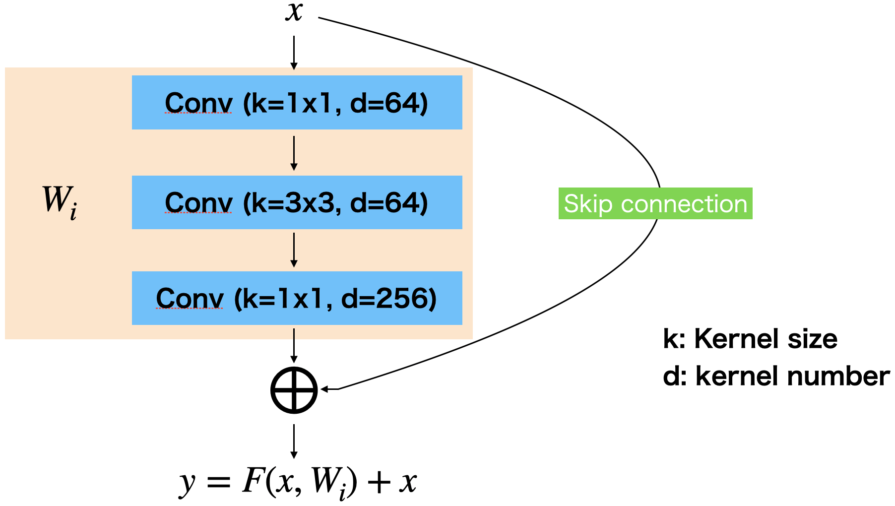

# ResNet

元論文 >> Deep Residual Learning for Image Recognition https://arxiv.org/abs/1512.03385

skip connectionにより152層までの学習を可能にした



18, 34, 50, 101, 152層がある


## pytorch torchvision

```python
import torch
import torch.nn as nn
import torch.nn.functional as F
import torchvision

def get_model(self, out_dim, dropout=0.5):
    model = models.resnet50(pretrained=True)
    del model.fc
    
    model.fc = nn.Sequential(
        nn.Linear(2048, 4096),
        nn.ReLU(),
        nn.Dropout(dropout),
        nn.Linear(4096, out_dim),
        nn.Sigmoid()
    )

    return model

```

## pytorch scratch

# ResNet50

```python
import torch
import torch.nn as nn
import torch.nn.functional as F

class ResNet50(torch.nn.Module):
    def __init__(self, out_dim):
        super(ResNet50, self).__init__()

        class ResBlock(torch.nn.Module):
            def __init__(self, in_f, f_1, out_f, stride=1):
                super(ResBlock, self).__init__()
                self.stride = stride
                self.fit_dim = False

                self.block = nn.Sequential(
                    nn.Conv2d(in_f, f_1, kernel_size=1, padding=0, stride=stride),
                    nn.BatchNorm2d(f_1),
                    nn.ReLU(),
                    nn.Conv2d(f_1, f_1, kernel_size=3, padding=1, stride=1),
                    nn.BatchNorm2d(f_1),
                    nn.ReLU(),
                    nn.Conv2d(f_1, out_f, kernel_size=1, padding=0, stride=1),
                    nn.BatchNorm2d(out_f),
                    nn.ReLU()
                )

                if in_f != out_f:
                    self.fit_conv = nn.Conv2d(in_f, out_f, kernel_size=1, padding=0, stride=1)
                    self.fit_bn = nn.BatchNorm2d(out_f)
                    self.fit_dim = True
        
            def forward(self, x):
                res_x = self.block(x)
                
                if self.fit_dim:
                    x = self.fit_conv(x)
                    x = self.fit_bn(x)
                    x = F.relu(x)
                
                if self.stride == 2:
                    x = F.max_pool2d(x, 2, stride=2)
                    
                x = torch.add(res_x, x)
                x = F.relu(x)
                return x

        self.module = nn.Sequential(
            nn.Conv2d(cfg.INPUT_CHANNEL, 64, kernel_size=7, padding=3, stride=2),
            nn.BatchNorm2d(64),
            nn.ReLU(),
            nn.MaxPool2d([3, 3], padding=1, stride=2),
            ResBlock(64, 64, 256), # ResBlock2
            ResBlock(256, 64, 256),
            ResBlock(256, 64, 256),
            ResBlock(256, 128, 512, stride=2), # ResBlock3
            ResBlock(512, 128, 512),
            ResBlock(512, 128, 512),
            ResBlock(512, 128, 512),
            ResBlock(512, 256, 1024, stride=2), # ResBlock4
            ResBlock(1024, 256, 1024),
            ResBlock(1024, 256, 1024),
            ResBlock(1024, 256, 1024),
            ResBlock(1024, 256, 1024),
            ResBlock(1024, 256, 1024),
            ResBlock(1024, 512, 2048, stride=2), # ResBlock5
            ResBlock(2048, 512, 2048),
            ResBlock(2048, 512, 2048)
        )
        
        self.avg_pool = torch.nn.AdaptiveAvgPool2d((1, 1))

        self.linear = torch.nn.Linear(2048, out_dim)
        
        
    def forward(self, x):
        x = self.module(x)

        x = self.avg_pool(x)
        x = x.view(x.size()[0], -1)
        x = self.linear(x)
        #x = F.softmax(x, dim=1)
        
        return x
```

## ResNet18

```python
class ResNet18(torch.nn.Module):
    def __init__(self, out_dim):
        super(ResNet18, self).__init__()

        class ResBlock(torch.nn.Module):
            def __init__(self, in_f, out_f, stride=1):
                super(ResBlock, self).__init__()

                self.stride = stride
                self.fit_dim = False

                self.block = torch.nn.Sequential(
                    torch.nn.Conv2d(in_f, out_f, kernel_size=3, padding=1, stride=stride),
                    torch.nn.BatchNorm2d(out_f),
                    torch.nn.ReLU(),
                    torch.nn.Conv2d(out_f, out_f, kernel_size=3, padding=1, stride=1),
                    torch.nn.BatchNorm2d(out_f),
                    torch.nn.ReLU()
                )

                if in_f != out_f:
                    self.fit_conv = torch.nn.Conv2d(in_f, out_f, kernel_size=1, padding=0, stride=1)
                    self.fit_dim = True
                    
            def forward(self, x):
                res_x = self.block(x)
                
                if self.fit_dim:
                    x = self.fit_conv(x)
                
                if self.stride == 2:
                    x = F.max_pool2d(x, 2, stride=2)
                    
                x = torch.add(res_x, x)
                x = F.relu(x)
                return x

        self.module = nn.Sequential(
            nn.Conv2d(cfg.INPUT_CHANNEL, 64, kernel_size=7, padding=3, stride=2),
            nn.BatchNorm2d(64),
            nn.ReLU(),
            nn.MaxPool2d([3, 3], padding=1, stride=2),
            ResBlock(64, 64), # ResBlock2
            ResBlock(64, 64),
            ResBlock(64, 128, stride=2), # ResBlock3
            ResBlock(128, 128),
            ResBlock(128, 256, stride=2), # ResBlock4
            ResBlock(256, 256),
            ResBlock(256, 512, stride=2), # ResBlock5
            ResBlock(512, 512),
        )

        self.avg_pool = torch.nn.AdaptiveAvgPool2d((1, 1))
        
        self.linear = torch.nn.Linear(512, out_dim)
        
        
    def forward(self, x):
        x = self.module(x)

        x = self.avg_pool(x)
        x = x.view(x.size()[0], -1)
        x = self.linear(x)
        return x
```

## ResNet34

```python
class ResNet34(torch.nn.Module):
    def __init__(self, out_dim):
        super(ResNet34, self).__init__()

        class ResBlock(torch.nn.Module):
            def __init__(self, in_f, out_f, stride=1):
                super(ResBlock, self).__init__()
                self.stride = stride
                self.fit_dim = False

                self.block = torch.nn.Sequential(
                    torch.nn.Conv2d(in_f, out_f, kernel_size=3, padding=1, stride=stride),
                    torch.nn.BatchNorm2d(out_f),
                    torch.nn.ReLU(),
                    torch.nn.Conv2d(out_f, out_f, kernel_size=3, padding=1, stride=1),
                    torch.nn.BatchNorm2d(out_f),
                    torch.nn.ReLU()
                )

                if in_f != out_f:
                    self.fit_conv = torch.nn.Conv2d(in_f, out_f, kernel_size=1, padding=0, stride=1)
                    self.fit_dim = True
                    
            def forward(self, x):
                res_x = self.block(x)
                
                if self.fit_dim:
                    x = self.fit_conv(x)
                
                if self.stride == 2:
                    x = F.max_pool2d(x, 2, stride=2)
                    
                x = torch.add(res_x, x)
                x = F.relu(x)
                return x

        self.module = nn.Sequential(
            nn.Conv2d(cfg.INPUT_CHANNEL, 64, kernel_size=7, padding=3, stride=2),
            nn.BatchNorm2d(64),
            nn.ReLU(),
            nn.MaxPool2d([3, 3], padding=1, stride=2),
            ResBlock(64, 64), # ResBlock2
            ResBlock(64, 64),
            ResBlock(64, 64),
            ResBlock(64, 128, stride=2), # ResBlock3
            ResBlock(128, 128),
            ResBlock(128, 128),
            ResBlock(128, 128),
            ResBlock(128, 256, stride=2), # ResBlock4
            ResBlock(256, 256),
            ResBlock(256, 256),
            ResBlock(256, 256),
            ResBlock(256, 256),
            ResBlock(256, 256),
            ResBlock(256, 512, stride=2), # ResBlock4
            ResBlock(512, 512),
            ResBlock(512, 512),
        )

        self.avg_pool = torch.nn.AdaptiveAvgPool2d((1, 1))
        
        self.linear = torch.nn.Linear(512, out_dim)
        
        
    def forward(self, x):
        x = self.module(x)

        x = self.avg_pool(x)
        x = x.view(x.size()[0], -1)
        x = self.linear(x)
        return x
```

## ResNet101

```python
class ResNet101(torch.nn.Module):
    def __init__(self, out_dim):
        super(ResNet101, self).__init__()

        class ResBlock(torch.nn.Module):
            def __init__(self, in_f, f_1, out_f, stride=1):
                super(ResBlock, self).__init__()

                self.stride = stride
                self.fit_dim = False

                self.block = torch.nn.Sequential(
                    torch.nn.Conv2d(in_f, f_1, kernel_size=1, padding=0, stride=stride),
                    torch.nn.BatchNorm2d(f_1),
                    torch.nn.ReLU(),
                    torch.nn.Conv2d(f_1, f_1, kernel_size=3, padding=1, stride=1),
                    torch.nn.BatchNorm2d(f_1),
                    torch.nn.ReLU(),
                    torch.nn.Conv2d(f_1, out_f, kernel_size=1, padding=0, stride=1),
                    torch.nn.BatchNorm2d(out_f),
                    torch.nn.ReLU()
                )

                if in_f != out_f:
                    self.fit_conv = torch.nn.Conv2d(in_f, out_f, kernel_size=1, padding=0, stride=1)
                    self.fit_bn = torch.nn.BatchNorm2d(out_f)
                    self.fit_dim = True
            
            def forward(self, x):
                res_x = self.block(x)
                
                if self.fit_dim:
                    x = self.fit_conv(x)
                    x = self.fit_bn(x)
                    x = F.relu(x)
                
                if self.stride == 2:
                    x = F.max_pool2d(x, 2, stride=2)
                    
                x = torch.add(res_x, x)
                x = F.relu(x)
                return x

        block = []
        for _ in range(22):
            block.append(ResBlock(1024, 256, 1024))
        resblock4s = torch.nn.Sequential(*block)

        self.module = nn.Sequential(
            nn.Conv2d(cfg.INPUT_CHANNEL, 64, kernel_size=7, padding=3, stride=2),
            nn.BatchNorm2d(64),
            nn.ReLU(),
            nn.MaxPool2d([3, 3], padding=1, stride=2),
            ResBlock(64, 64, 256), # ResBlock2
            ResBlock(256, 64, 256),
            ResBlock(256, 64, 256),
            ResBlock(256, 128, 512, stride=2), # ResBlock3
            ResBlock(512, 128, 512),
            ResBlock(512, 128, 512),
            ResBlock(512, 128, 512),
            ResBlock(512, 256, 1024, stride=2), # ResBlock4
            resblock4s,
            ResBlock(1024, 512, 2048, stride=2), # ResBlock4
            ResBlock(2048, 512, 2048),
            ResBlock(2048, 512, 2048),
        )

        self.avg_pool = torch.nn.AdaptiveAvgPool2d((1, 1))
        
        self.linear = torch.nn.Linear(2048, out_dim)
        
        
    def forward(self, x):
        x = self.module(x)

        x = self.avg_pool(x)
        x = x.view(x.size()[0], -1)
        x = self.linear(x)
        return x
```

## ResNet152

```python
class ResNet152(torch.nn.Module):
    def __init__(self, out_dim):
        super(ResNet152, self).__init__()

        class ResBlock(torch.nn.Module):
            def __init__(self, in_f, f_1, out_f, stride=1):
                super(ResBlock, self).__init__()

                self.stride = stride
                self.fit_dim = False

                self.block = torch.nn.Sequential(
                    torch.nn.Conv2d(in_f, f_1, kernel_size=1, padding=0, stride=stride),
                    torch.nn.BatchNorm2d(f_1),
                    torch.nn.ReLU(),
                    torch.nn.Conv2d(f_1, f_1, kernel_size=3, padding=1, stride=1),
                    torch.nn.BatchNorm2d(f_1),
                    torch.nn.ReLU(),
                    torch.nn.Conv2d(f_1, out_f, kernel_size=1, padding=0, stride=1),
                    torch.nn.BatchNorm2d(out_f),
                    torch.nn.ReLU()
                )

                if in_f != out_f:
                    self.fit_conv = torch.nn.Conv2d(in_f, out_f, kernel_size=1, padding=0, stride=1)
                    self.fit_bn = torch.nn.BatchNorm2d(out_f)
                    self.fit_dim = True
        
            def forward(self, x):
                res_x = self.block(x)
                
                if self.fit_dim:
                    x = self.fit_conv(x)
                    x = self.fit_bn(x)
                    x = F.relu(x)
                
                if self.stride == 2:
                    x = F.max_pool2d(x, 2, stride=2)
                    
                x = torch.add(res_x, x)
                x = F.relu(x)
                return x

        block = []
        for _ in range(7):
            block.append(ResBlock(512, 128, 512))
        resblock3s = torch.nn.Sequential(*block)

        block = []
        for _ in range(35):
            block.append(ResBlock(1024, 256, 1024))
        resblock4s = torch.nn.Sequential(*block)

        self.module = nn.Sequential(
            nn.Conv2d(cfg.INPUT_CHANNEL, 64, kernel_size=7, padding=3, stride=2),
            nn.BatchNorm2d(64),
            nn.ReLU(),
            nn.MaxPool2d([3, 3], padding=1, stride=2),
            ResBlock(64, 64, 256), # ResBlock2
            ResBlock(256, 64, 256),
            ResBlock(256, 64, 256),
            ResBlock(256, 128, 512, stride=2), # ResBlock3
            resblock3s,
            ResBlock(512, 256, 1024, stride=2), # ResBlock4
            resblock4s,
            ResBlock(1024, 512, 2048, stride=2), # ResBlock4
            ResBlock(2048, 512, 2048),
            ResBlock(2048, 512, 2048),
        )

        self.avg_pool = torch.nn.AdaptiveAvgPool2d((1, 1))
        
        self.linear = torch.nn.Linear(2048, out_dim)
        
        
    def forward(self, x):
        x = self.module(x)

        x = self.avg_pool(x)
        x = x.view(x.size()[0], -1)
        x = self.linear(x)
        return x
```